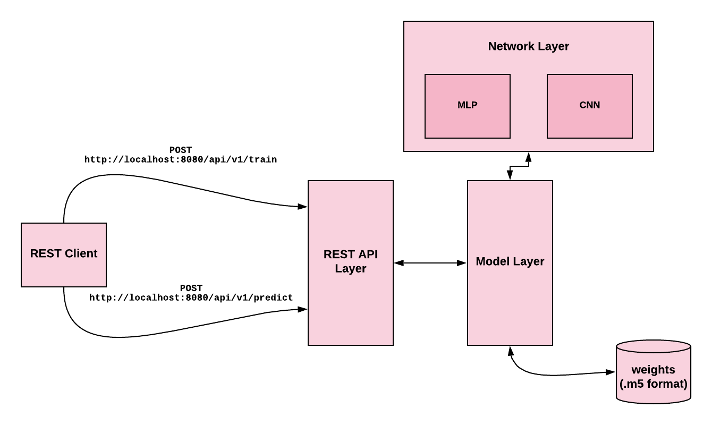
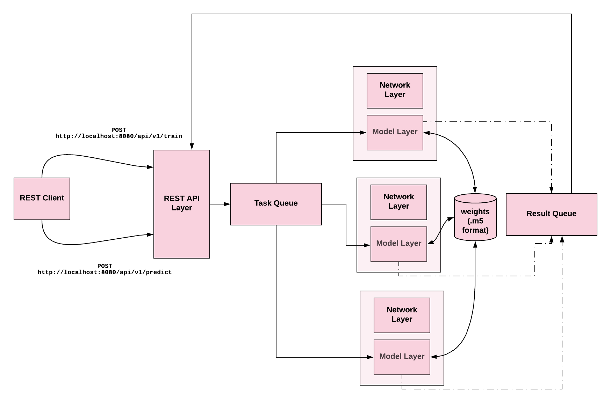

# Machine Learning Developer Challenge
## Context
The Open Innovation team has developed in collaboration with a public research laboratory a new model to classify images from handwritten digits. The model, delivered in tensorflow.keras, seems to have good performances but the team needs to conduct more tests to confirm the results.
Moreover, the code is not integrated in any part of Imagia’s pipeline.

The goal of this exercise is to bring this code a step closer to industrial production by enhancing and integrating it into a service.

## Dependencies

This project requires Python 3.6+ and the following Python libraries:
* TensorFlow
* Flask
* ImageIO
* Numpy

In addition to that, we have used several packages (such as `pylint` and `yapf`) for development purposes.

We use `pipenv` as our package management tool. So you might need to install it using the following command.

`pip install pipenv`

For more information please refer [Pipenv](https://docs.pipenv.org/en/latest/) documentation. 

## How to Deploy and Run

We have used `pipenv` as our dependency management tool. For deploying the service we use `docker`.  Details for setting up both environments are given below. 

### Development Setup

Setting up the development environment is fairly easy with `pipenv`. You just need to run following command to set up the development environment. 

```bash
pipenv install --dev
```

`pipenv ` can also be used to setup the production environment as well. If you wish to do so please run the following command.

```bash
pipenv install --ignore-pipfile
```

Once the development setup is completed you can run units testing by executing following command.

```bash
 pipenv run python -m unittest
```

n order to convert `mnist.npz` file to `*.tfrecords` please run the following command from the root folder of the repo.

```bash
pipenv run python digit_recognizer/datasets/conver_tf.py
```

Also, we have provided a command-line interface to easily interact with the system. This tool comes really handy when we developing/debugging the system.

* The following command runs a simple MLP network
```bash
pipenv run python -m training.run_training  --configs  '{"dataset": "MnistDataset",  "dataset_args": {"image_size": [28, 28]}, "model": "DigitModel", "network": "mlp", "network_args": {}, "train_args": {"batch_size": 32, "epochs": 10}, "save_weights": true}' 
```
* The following command runs simple LeNet type CNN model.
```bash
pipenv run python -m training.run_training  --configs  '{"dataset": "MnistDataset",  "dataset_args": {"image_size": [28, 28, 1]}, "model": "DigitModel", "network": "lenet5", "network_args": {}, "train_args": {"batch_size": 32, "epochs": 10}, "save_weights": true}'
```

### Deployment Setup

A Docker file is provided for production deployment. Please run the following commands to setup the project for production.

1. Build the docker container `sudo docker build .`
2. Run the docker container `sudo docker run -it -p 8080:8080  --name <name> <container_id>`

In addition to that, you can also use `pipenv` to deploy the service.

1. Setup the environment `pipenv install --ignore-pipfile`
2. Run the service `pipenv run python -m digit_recognizer.api.app`


### Model Training and Predictions

Once the service is up and running, you can use it for model training and production.

#### Training a new Model

You can train various type of networks (such as `mlp` and `cnn`) with different parameters (such as `batch_size`, `epochs`, and etc). All these parameters should be sent as a `JSON` configuration object as described below.

##### Training Feedforward Neural Network

1. Training simple feedforward neural network:
   
   ```bash
   curl -X POST -H "Content-Type: application/json"  -d '{"dataset": "MnistDataset", "model": "DigitModel", "network": "mlp", "network_args": {}, "train_args": {"batch_size": 32, "epochs": 10}, "save_weights": true}'  http://localhost:8080/api/v1/train
   ```

   Above command will train a simple MLP model with default network parameters (`layer_sizes` and `dropout_amount` and `activation`). We have set `batch_size` = 32 and `epochs`=10. The REST endpoint we have developed for is `http://localhost:8080/api/v1/train` and it accepts POST requests. 

   Once the training is done training and testing accuracy/loss will be sent in the response.
   
   ```json
   {  
   "message":{  
      "status":"success",
      "test":{  
         "accuracy":0.9953636527061462,
         "loss":0.014726323728398204
      },
      "train":{  
         "accuracy":0.9732099771499634,
         "loss":0.08598016251079912
      }
    }
   }
   ```

2. Training a simple feedforward neural network with different network parameters.

   Following `curl` trains a  new model with `activation=tanh`, `dropout_amount=0.1`,  `batch_size=64` and `epochs=16`

   ```bash
   curl -X POST -H "Content-Type: application/json"  -d '{"dataset": "MnistDataset", "model": "DigitModel", "network": "mlp", "network_args": {"activation": "tanh", "dropout_amount": 0.1}, "train_args": {"batch_size": 64, "epochs": 16}, "save_weights": true}'  http://localhost:8080/api/v1/train
   ```

   ```json
   {  
   "message":{  
      "status":"success",
      "test":{  
         "accuracy":0.9978727102279663,
         "loss":0.006964784036302072
      },
      "train":{  
         "accuracy":0.983184814453125,
         "loss":0.05572984771337253
      }
    }
   }
   ```

   Also, we can save the trained model using `save_weights` parameter. If it is true (`save_weights=True`) we save network weights.

##### Training CNN Networks

The following `curl` command can be used to train a simple LeNet type CNN model.

```bash
curl -X POST -H "Content-Type: application/json"  -d '{"dataset": "MnistDataset",  "dataset_args": {"image_size": [28, 28, 1]}, "model": "DigitModel", "network": "lenet5", "network_args": {}, "train_args": {"batch_size": 32, "epochs": 10}, "save_weights": true}'  http://localhost:8080/api/v1/train
```

```json
{
  "message": {
    "status": "success",
    "test": {
      "accuracy": 0.9914000034332275,
      "loss": 0.03459310118334911
    },
    "train": {
      "accuracy": 0.9895433187484741,
      "loss": 0.03331728453018101
    }
  }
}
```

**Note:** we have changed `network` parameter to `lenet5`. For training our simple feedforward neural network we set `network` parameter to `mlp`


#### Predict new Images 

We use `http://localhost:8080/api/v1/predict` service for predicting new images. Example `curl` command:

```bash
curl -X POST -F image=@./digit_recognizer/example/8.png 'http://localhost:8080/api/v1/predict'
```

```json
{
  "prediction": 8, 
  "probability": 0.9988
}
```

## High-level Architecture

<div align="center">
 
 <p align="center"><b>Figure 1:</b> High-level architecture of the system</p>
</div>

**Figure: 1** shows the high-level architecture of our system. As the picture depicts, end-user directly communicates with the system using REST APIs. In the current implementation, we have provided two key end-points for model training and predictions.

The **Model Layer** is an abstract representation of machine learning models. All common utility methods (which are common for all machine learning models) such as `fit`, `predict` and `save_weights` and `load_weights` are implemented inside this module.

The concrete networks are defined inside the **Network Layer**.

## REST API Documentation

1. `POST` `http://localhost:8080/api/v1/train`
    1. Request Body: `JSON` object for instance: 
       ```json
       {  
            "dataset":"MnistDataset",
            "model":"DigitModel",
            "network":"mlp",
            "network_args":{  
                "activation": "relu",
                "dropout_amount": 0.2
            },
            "train_args":{  
                "batch_size":32,
                "epochs":10
            },
            "save_weights":true
        }
       ```
    2. Response
       ```json
          {  
            "message":{  
                "status":"success",
                "test":{  
                    "accuracy":0.9978727102279663,
                    "loss":0.006964784036302072
                },
                "train":{  
                    "accuracy":0.983184814453125,
                    "loss":0.05572984771337253
                }
            }
          }  
       ```
    3. Status Codes: 
        1. `200` if If the model building is success
        2.  `422` messing required parameters
        3. `500` internal server error

2. `POST` `http://localhost:8080/api/v1/predict`
    1. Request body: binary data to predict on. Format of file: `png` 

    2. Response
       ```json
       {
        "prediction": 8, 
        "probability": 0.9988
        }
       ```
    3. Status Codes: 
        1. `200` prediction method executed without error
        2. `500` internal server error


## Extensions and Future Directions

In this assignment, we have implemented a simple ML system for digit recognition. We implemented it in such a way that, it can be used to quickly experiment with different parameters such as `batch_size`, `epochs`, `activation` and etc. 

Also, we can add new networks (right now we have implemented `mlp` and `lenet`) by implementing them inside `network` module. 

When it comes to extensions and future directions, I would like to highlight followings.

1. We did a very little amount of error checking and input validation. This is an obvious future improvement.
2. provide the facility to hyper-parameter optimization. 
3. Improve the scalability and model inference time.
4. Develop a [Swagger](https://swagger.io/)  doc for API documentation

**Please kindly note that**: normally when I develop a production quality software, I do a lot of comments. Due to time restriction, this codebase contains very little amount of comments

## Answers to Questions

* Is there any functionality you think would add value to the service?

  I would like to add a few REST endpoints and I think that would increase the usability of the service. Presently, we have implemented `http://localhost:8080/api/v1/train` as a blocking service. Once we call this endpoint,  the endpoint will stay at the blocking state until the training is done. For some models (such as training a model on ImageNet dataset) which take a lot of time to train, this behavior is not desirable. So I would like to modify this endpoint as described below.

    * Implement `http://localhost:8080/api/v1/train` as a non-blocking service. More detail on implementing this non-blocking service is given in the next answer. Once you call this endpoint, you will get a token. This token can be used for querying the status of the training process. 

    `POST`  `http://localhost:8080/api/v1/train`
    ```json
    {
    "key": "ba99783f-8ae3-4348-8bea-dd5e25ba83ab",
    "message": " model training stared. For quering the status of the training process use the provided key"
    }
    ```

    * Next, we need another service to query the status of the training process.

    `GET` `http://localhost:8080/api/v1/train/<key>`
    
    This will return the status of the model training. For example:

    ```json
    {
    "statue": "training_inprograss", 
    "current_epoch":  8,
    "current_loss": 0.1234
    }
    ```

* How would you scale this service?
  
  The blocking `http://localhost:8080/api/v1/train/` endpoint is one of the main bottlenecks of the system.  So I would like to propose the following architecture. That helps us to implement non-blocking `http://localhost:8080/api/v1/train/`. 

  <div align="center">
   
   <p align="center"><b>Figure 2:</b> Improved Architecture</p>
  </div>

  According to the new architecture, all new training and prediction requests are submitted to a `Task Queue`. Training and production results are also submitted to a `Result Queue`. Hence, we can increase the number of **Network+Model** unites. Hence, we can increase the scalability of the system. In addition to that, we can use container orchestration techniques such as 
  kubernetes to autoscaling **Network+Model** unites.

* How would you reduce inference time?

  Obviously, we can use better hardware to increase inference performance. In addition to that, we can use the following techniques to increase the inference performance. 

  * Fusion: We can fuse graph operations. Consider three graph operations: `Batch Normalization`, `ReLU`, and `Convolution` . We can combine three operations together and create one single graph operation. Actually, Tensorflow is capable of such optimizations. 

  * Reduce precision when it comes to inference: Deep Learning models are typically trained with single precision floating point numbers. But when it comes to inference we can use 16 or 8-bit floating point numbers. 

  * Graph to Binary Optimization: Compiling computational graph to machine instructions can also help to improve inference performance.

* What would happen if we post a dog picture? Do you see any way to handle this situation?
  
  It will predict a digit out of 10 digits. But the confidence level (confidence probability) will be very low.

# Old Readme File (I didn't change it)

## Starting Point
The model delivered by the research lab is a simple CNN with two convolutions. It was trained using the `tensorflow.keras` framework.

This repository contains:

* `main.py`, which is the source code delivered by the research lab
* `weights.h5`, which are the weights of the pretrained model

So far, two functionalities has been implemented:
```
python main.py --train
```

Will launch a training and overwrite weights.h5
```
python main.py --predict [path_to_image]
```

Will launch a prediction on a single image (for example `python --predict example/8.png` should output `Predicted: 8`).

## Requirements

This challenge contains two parts. First, Imagia wishes to use tfrecords data instead of `mnist.load_data()` (line 29). This requires that you build a small pipeline providing multiple steps:
* Process the 'data/mnist.npz' raw data to convert them to a `.tfrecord` format 
* The data postprocessing and transformation should come with unit tests
* Modify the `train()` function consequently
* Feel free to modify the code structure as much as needed

Second, you will have to integrate this modified code into a **very light** RESTful service which can handle the following requests:

| Request Method | Resource | Request Header | Request Body  | Response Body | Response Status Code |
| ------------- |:-------------:|:-------------:| -----:| -----:| -----:|
| TBD | http://IP:port/train | TBD | TBD | `{accuracy: x}` | TBD |
| `POST` | http://IP:port/predict | TBD | binary data to predict on. Format of file: `png` | `{prediction: x}` | TBD |

We ask you to meet the following requirements:
* Python >= 3.x
* Documentation (technical and readme to launch the service)
* We should be able to run and test the implemented solution
* Build a docker image for easier deployment

Questions:
* Is there any functionality you think would add value to the service?
* How would you scale this service?
* How would you reduce inference time?
* What would happen if we post a dog picture? Do you see any way to handle this situation?
